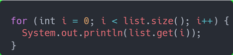
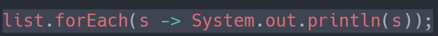

# Lambda

## Introduction
- Objectif des lambdas : amener la programmation fonctionnelle en Java
- Programmation fonctionnelle : pouvoir passer en argument ou retourner une fonction (élimine beaucoup de code «boilerplate» / très expressif)
- L'utilisation de lambda est prépondérante dans les streams et correspond à une programmation souvent plus moderne
- Cas d’utilisation
  - En tant que développeur «de code générique», je définis mon enchainement de traitements où les parties «variables» sont représentées sous forme de «@FonctionalInterface»
  - En tant que développeur «utilisateur», j’utilise les fonctions proposées en fournissant des lambdas correspondant aux «@FonctionalInterface» attendues

## Référence
- https://www.jmdoudoux.fr/java/dej/chap-lambdas.htm#lambdas-2
- https://www.baeldung.com/java-8-functional-interfaces

# Exemple
A la place du programme **impératif** suivant :


On aura une version plus expressive et simple en ajoutant de la programmation fonctionnelle : 


## Fonctionnement
Les expressions lambdas sont toujours liées à une [@FunctionalInterface](https://www.baeldung.com/java-8-functional-interfaces)

## Functional interface
En reprenant l'exemple précédent, on voit que la méthode "forEach" prend en paramètre une interface fonctionnelle : 
```text
list.forEach(Consumer<? super T> action)
```
- une interface fonctionnelle est simplement une interface qui ne possède qu'une méthode abstraite.
- c'est cette méthode que nous allons exprimer via l'expression lambda
- une interface fonctionnelle peut cependant avoir des méthodes "static" ou "default" (voir par exemple l'interface fonctionnelle (Fontion.class)[https://docs.oracle.com/javase/8/docs/api/java/util/function/Function.html)
- Même si l'annotation @FonctionalInterface n'est pas obligatoire, il est fortement conseillé de l'indiquer afin d'obtenir des erreurs de compilation en cas de développement futures érronés

## Lambda expression
Le contrat d'interface étant défini par la @FonctionalInterface, nous allons voir la syntax permettant d'écrire la lambda associé.
